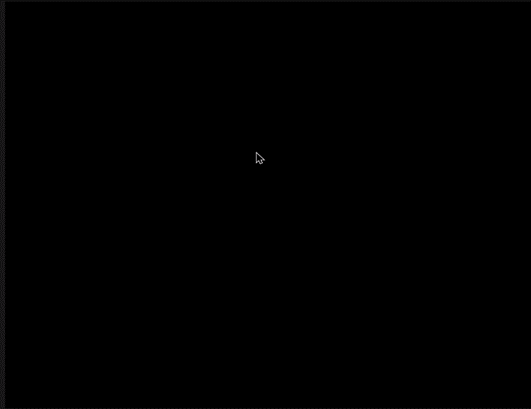

# Autism Spectrum Disorder (ASD) Detection and Chatbot Insights

This project aims to predict the probability of Autism Spectrum Disorder (ASD) in patients using 3D Convolutional Neural Networks (CNN) on MRI scans. It also includes a chatbot that provides insights based on the model's predictions using a Retrieval-Augmented Generation (RAG) model.

 ---
 
## Table of Contents

- [Introduction](#introduction)
- [Dataset](#dataset)
- [Preprocessing](#preprocessing)
- [Model](#model)
- [RAG Model](#rag-model)
- [Web Application](#web-application)
- [Usage](#usage)
- [Sample Case](#sample-case)
- [References](#references)

## Introduction

This repository contains the code and instructions for building a web application that predicts the probability of ASD from MRI scans and provides detailed insights via a chatbot. The project involves several steps:
1. Preprocessing the MRI scans.
2. Training a 3D CNN model for ASD detection.
3. Building a RAG model to generate insights based on the model's predictions.
4. Creating a Flask web application for users to interact with the system.

## Dataset

We are using the ABIDE dataset for collecting MRI scans. Ensure you have the dataset properly organized and accessible.


The Autism Brain Imaging Data Exchange (ABIDE) dataset is a comprehensive collection of neuroimaging data from individuals with Autism Spectrum Disorder (ASD) and typical controls. It aims to advance the scientific understanding of ASD by providing a large-scale, publicly available dataset for research and analysis.

The data were collected from 17 different sites worldwide, resulting in a diverse sample that includes a wide range of ages, cognitive abilities, and ASD severities. Each site followed a standardized protocol for data acquisition to ensure consistency and reliability across the dataset.

## Preprocessing

The preprocessing involves several steps:
1. **Loading the MRI scan**: The scans are loaded into the program.
2. **Normalizing the scan to the MNI template**: Ensuring the scans are consistent in orientation and size.
3. **Skull stripping using FSL's BET**: Removing non-brain tissues from the scans.
4. **Bias field correction using ANTs**: Correcting intensity non-uniformity in the scans.

**Before Preprocessing**


**After Preprocessing**




For detailed preprocessing code, refer to the [preprocessing script](PreProcessing.py).

## Model

We use a 3D CNN to predict the probability of ASD from preprocessed MRI scans. The model architecture includes several convolutional layers, pooling layers, and dense layers designed to handle the 3D nature of MRI data.

For the detailed model architecture and training process, refer to the [model script](Model.py).

## RAG Model

The RAG model combines the probability output from the CNN with a chatbot to provide detailed insights based on user queries. This involves:
1. **Loading relevant data**: Data is loaded and processed for insights.
2. **Creating embeddings**: Textual data is converted into embeddings for similarity calculations.
3. **Retrieving relevant information**: Relevant information is retrieved based on user queries.
4. **Generating responses**: A detailed and empathetic response is generated for the user.

For detailed RAG model implementation, refer to the [RAG model script](RAG_model.py).

## Web Application

We use Flask to build the web application where users can upload their MRI scans, get the ASD prediction, and interact with the chatbot. The web app handles:
1. **File uploads**: Users can upload their MRI scans.
2. **Preprocessing and prediction**: The uploaded scans are preprocessed and fed into the CNN model for prediction.
3. **Chatbot interaction**: Users can interact with the chatbot to get insights based on the prediction.

For the detailed web application implementation, refer to the [web application script](app.py).

## Usage

1. Start the Flask web application:
   ```bash
   python app.py
   ```

2. Open your web browser and go to `http://127.0.0.1:5000/`.

## Sample Case

1. Open the website.
2. Upload the [anat](sample/anat.nii.gz) file provided in the [sample](sample) folder.
3. Ask your queries regarding the diagnosis.

## References
- [ABIDE Dataset](http://fcon_1000.projects.nitrc.org/indi/abide/)
- [ANTs (Advanced Normalization Tools)](http://stnava.github.io/ANTs/)
- [FSL (FMRIB Software Library)](https://fsl.fmrib.ox.ac.uk/fsl/fslwiki/)

